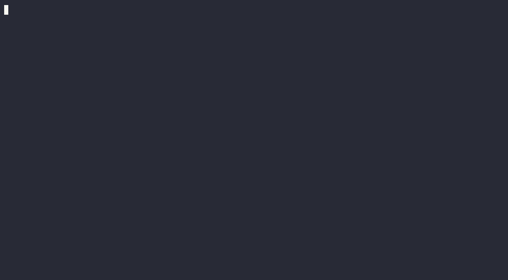

# RedStone payload verification bench (RFP-020 prototype)

This branch extends [`fryorcraken/lez-signature-bench`](https://github.com/fryorcraken/lez-signature-bench)
with the piece its roadmap listed as future work: **real RedStone
data-package parsing and verification** inside an NSSA-wrapped LEZ guest,
measured end-to-end through the RISC0 prover on live gateway payloads.

Built by [NODERS](https://noders.team) as a feasibility prototype for
[Logos RFP-020 — RedStone Off-Chain Oracle Adaptor for LEZ](https://github.com/logos-co/rfp/blob/master/RFPs/RFP-020-redstone-oracle-adaptor.md).



*Live run on Apple M4 Pro: a fresh gateway snapshot is fetched, three
`redstone-primary-prod` signers are recovered in-guest, and a real STARK
receipt is produced. Proving idle time is compressed in the recording;
the actual wall-clock time is printed in the output (`prove=154.45s`).
Replayable source: [docs/redstone-demo.cast](docs/redstone-demo.cast).*

## What it adds

- `methods/guest/src/lib.rs` — `redstone` module: the adaptor verification
  core as specified by RFP-020. Parses the exact byte serialization RedStone
  data nodes sign (`dataPoints || timestamp(6) || value_size(4) || count(3)`),
  enforces feed-id match, staleness (`maxAge` + bounded future drift),
  zero/negative-value rejection, keccak256 + secp256k1 ECDSA recovery,
  authorised-signer-set membership, signer dedup, M-of-N threshold, and
  median aggregation. All failure modes return the typed errors RFP-020
  enumerates (stale package, threshold not met, signer not in set, asset
  mismatch, malformed package, invalid signature, zero price).
- `methods/guest/src/bin/redstone.rs` — NSSA-wrapped guest binary.
- `src/bin/redstone_bench.rs` — host runner: loads a DDL gateway response
  (`data-packages/latest/redstone-primary-prod`), reconstructs the signed
  bytes, pre-verifies recovery on the host, then proves the guest with
  `RISC0_DEV_MODE=0` and reports cycles / prove time / receipt size.

## Measured result (live payload)

Machine: Apple M4 Pro (14 cores, 48 GB), CPU prover.
Stack: risc0-zkvm 3.0.5, LEZ v0.2.0-rc3, Rust 1.92.

| case | total cycles | user cycles | segments | prove time | receipt |
|---|---:|---:|---:|---:|---:|
| synthetic ECDSA k1 verify, N=3 (upstream bench) | 1 081 344 | 989 668 | 2 | 81.9 s | 716 649 B |
| **RedStone XMR/USD, live 3-of-5 packages** | 2 097 152 | 1 879 930 | 2 | 140.9 s | 790 361 B |

Signers recovered in-guest match the advertised `redstone-primary-prod`
roster. Negative paths verified: a 2-of-5 input against a 3 threshold is
rejected inside the guest with `signer threshold not met`.

Key delta vs the synthetic rows: RedStone semantics require ECDSA
**recovery** (ecrecover-style, ~620K user cycles/signature including
address derivation) rather than plain verification (~316K/signature),
plus payload parsing and median aggregation.

## Run it

```bash
# fetch a live gateway snapshot
curl -s "https://oracle-gateway-1.a.redstone.finance/data-packages/latest/redstone-primary-prod" \
  > fixtures/redstone-latest.json

RISC0_DEV_MODE=0 cargo run --release --bin redstone_bench -- \
  --json fixtures/redstone-latest.json --feed XMR --n 3 --threshold 3
```

Research bench for feasibility measurement on testnet/localnet; not
audited for production use.
